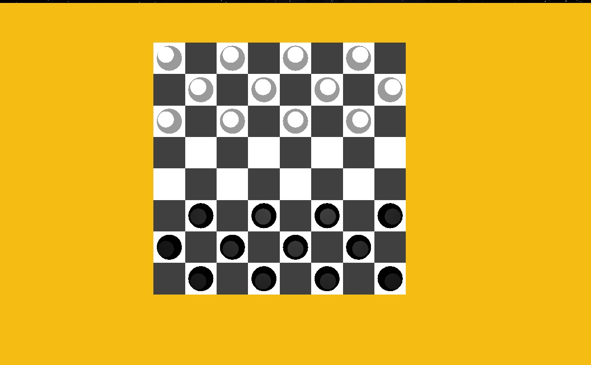
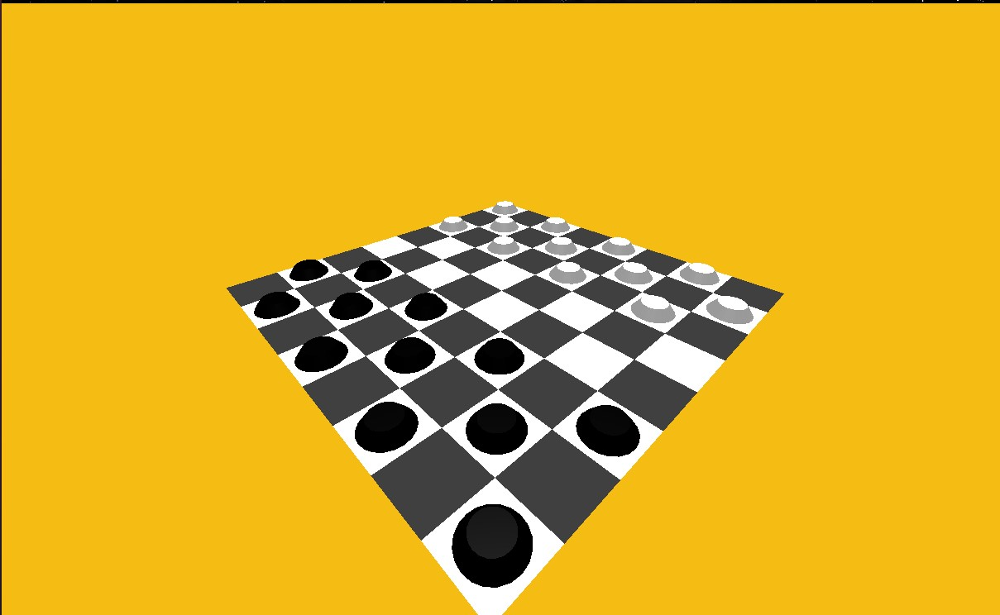

# Шашки Three.js

***

## Описание

В проекте реализовано отображение доски с шашками с использованием Three.js.

Используются:
* Three.js
* HTML, CSS, JS

---

## Запуск

Запустите файл _index.html_.

---

## Результат

